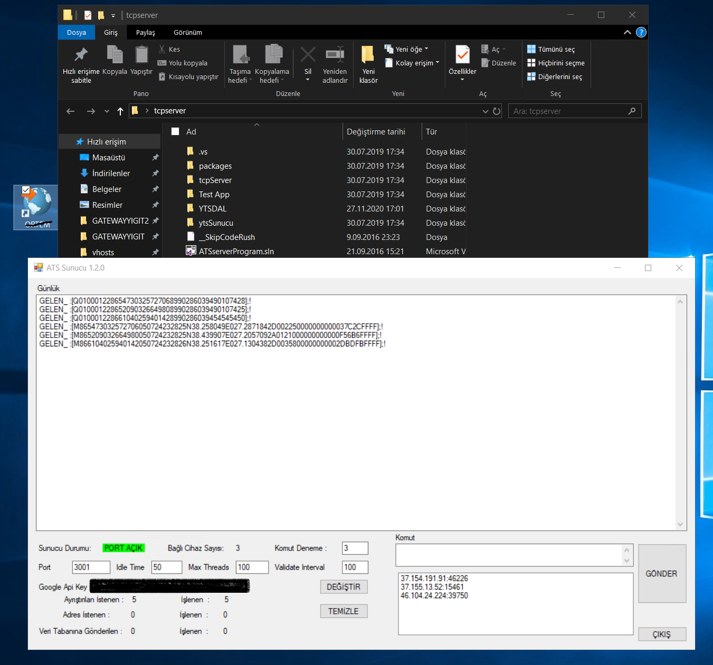
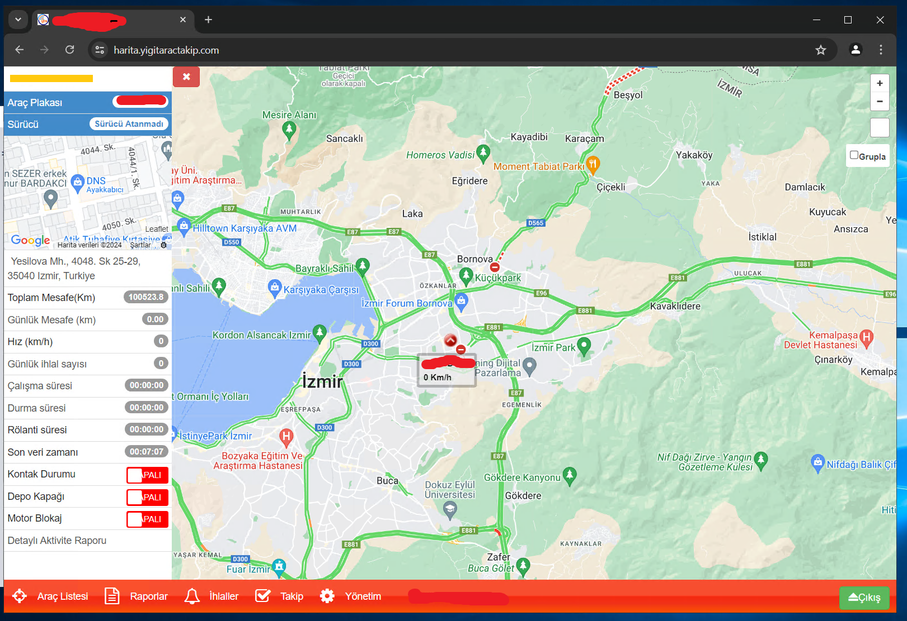
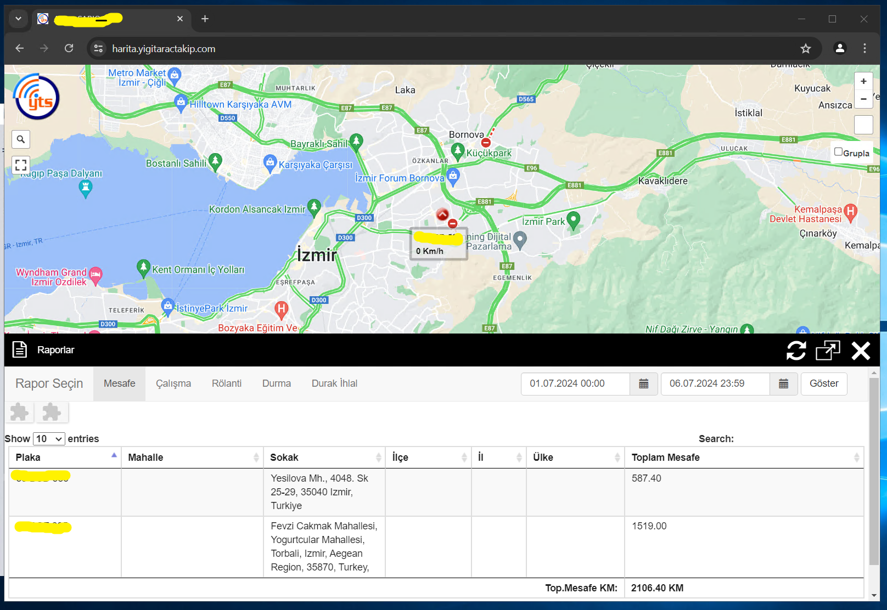

# GPS Vehicle Tracking System

This project is a GPS Vehicle Tracking System that allows users to monitor and track the location of vehicles in real-time. The system provides a user-friendly interface to view vehicle movements on a map, log data, and analyze travel history.





 

## Table of Contents
- [Features](#features)
- [Technologies Used](#technologies-used)
- [Installation](#installation)
- [Usage](#usage)
- [Configuration](#configuration)
- [Contributing](#contributing)
- [License](#license)
- [Contact](#contact)

## Features
- Real-time tracking of vehicle location.
- Display of vehicle movement on an interactive map.
- Logging of vehicle travel history.
- User authentication and role management.
- Notifications for specific events (e.g., vehicle entering/exiting a geofence).
- Data visualization and reporting tools.

## Technologies Used
- **Backend:** C#, .NET Framework, Entity Framework
- **Frontend:** HTML, CSS, JavaScript, Bootstrap
- **Database:** SQL Server
- **APIs:** Google Maps API
- **Others:** Docker, Git

## Installation

### Prerequisites
- Visual Studio 2017 or later
- .NET Framework 4.6.1 or later
- SQL Server
- Docker (optional)

### Steps
1. **Clone the repository:**
    ```bash
    git clone https://github.com/susaglam/GPSVehicleTrackingSystem.git
    cd GPSVehicleTrackingSystem
    ```

2. **Open the solution file:**
    - Open `GPSVehicleTrackingSystem.sln` in Visual Studio.

3. **Restore NuGet packages:**
    - In Visual Studio, right-click on the solution in the Solution Explorer and select `Restore NuGet Packages`.

4. **Set up the database:**
    - Ensure SQL Server is running.
    - Update the connection strings in `app.config` if necessary.

5. **Run the application:**
    - Press `F5` in Visual Studio to build and run the application.

### Using Docker
1. **Build the Docker image:**
    ```bash
    docker build -t gps-vehicle-tracking-system .
    ```

2. **Run the Docker container:**
    ```bash
    docker run -d -p 8080:80 gps-vehicle-tracking-system
    ```

## Usage
- Access the application via `http://localhost:8080` in your web browser.
- Register for an account and log in.
- Add vehicles to track by entering their GPS details.
- Monitor the vehicles in real-time on the map interface.
- View travel history and generate reports.

## Configuration
The application requires certain configurations which are specified in the `app.config` file.

### Connection Strings
- `AracTakipDb`: This connection string is used by Entity Framework to connect to the SQL Server database.
  ```xml
  <connectionStrings>
    <add name="AracTakipDb" connectionString="metadata=res://*/AracTakip.csdl|res://*/AracTakip.ssdl|res://*/AracTakip.msl;provider=System.Data.SqlClient;provider connection string=&quot;data source=localhost;initial catalog=ats_db_2017;integrated security=True;MultipleActiveResultSets=True;App=EntityFramework&quot;"
      providerName="System.Data.EntityClient" />
  </connectionStrings>
  ```

- `ATS.Properties.Settings.baglanti`: This connection string is used for general database operations.
  ```xml
  <connectionStrings>
    <add name="ATS.Properties.Settings.baglanti" connectionString="Data Source=localhost;Initial Catalog=ats_db_2017;Integrated Security=True"
      providerName="System.Data.SqlClient" />
  </connectionStrings>
  ```

### API Keys
- `google-apikey`: Google Maps API key is required for map functionalities.
  ```xml
  <appSettings>
    <add key="google-apikey" value="YOUR_GOOGLE_MAPS_API_KEY"/>
  </appSettings>
  ```

Replace `YOUR_GOOGLE_MAPS_API_KEY` with your actual Google Maps API key.

## Contributing
We welcome contributions to enhance this project! Here’s how you can help:
1. Fork the repository.
2. Create a new branch (`git checkout -b feature/YourFeature`).
3. Make your changes and commit them (`git commit -m 'Add new feature'`).
4. Push to the branch (`git push origin feature/YourFeature`).
5. Open a pull request.

## License
This project is licensed under the MIT License. See the [LICENSE](LICENSE) file for more details.


## Contact
If you have any questions or suggestions, feel free to reach out:
- Email: [saglamsukru@gmail.com](mailto:saglamsukru@gmail.com)
- GitHub: [susaglam](https://github.com/susaglam)
